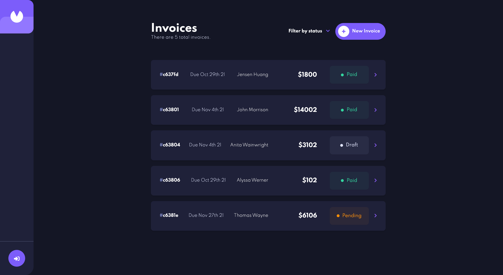

## Invoice App

Invoice App is the easiest way to create professional invoices and estimates for your customers. Users can create, read, update, and delete invoices. Users can also filter invoices by status ​​(draft/pending/paid).

## Features

✅ Create, read, update, and delete invoices\
✅ Receive form validations when trying to create/edit an invoice\
✅ Save draft invoices, and mark pending invoices as paid\
✅ Filter invoices by status (draft/pending/paid)

## 👨‍💻 Demo

Try out the website : [Invoice App](https://invoice-app-sand.vercel.app/)

## 👨‍🔧 Tech Stack

